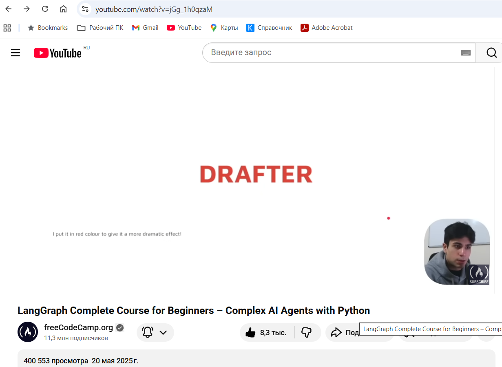
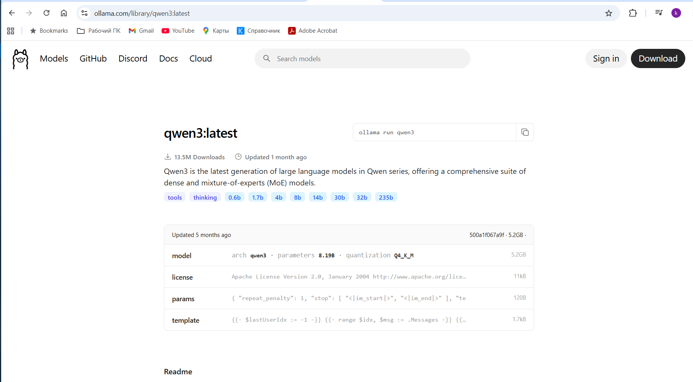
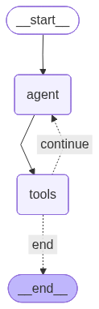
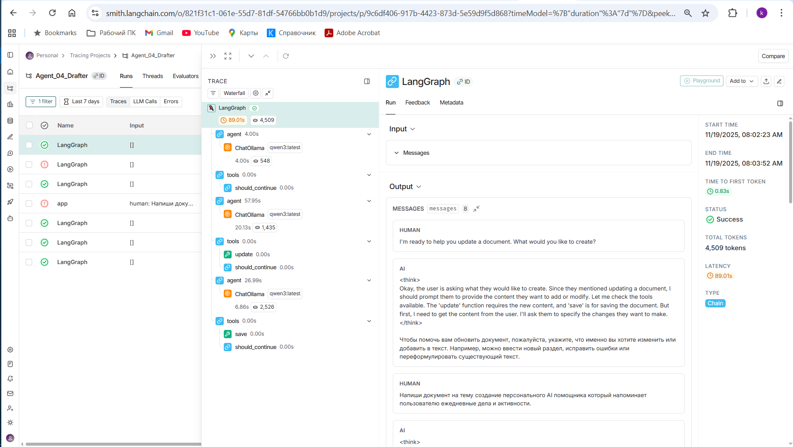
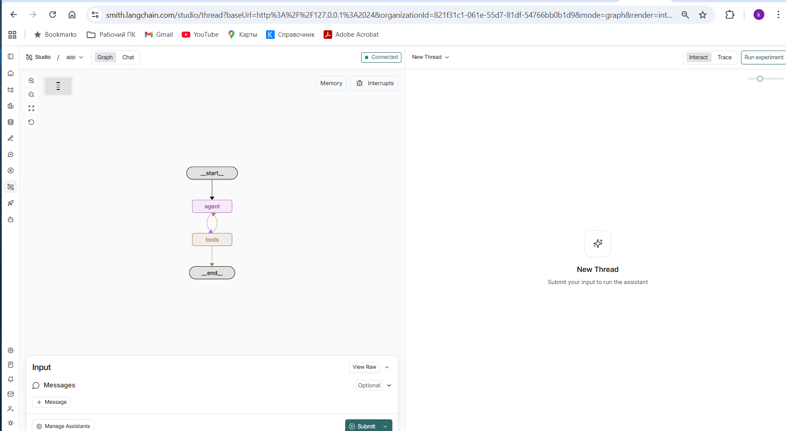

# 📄 Система AI для ускорения подготовки документов (Drafter)
## Что такое AI Agent

**AI Agent** — это автономная система, которая:

* использует LLM для принятия решений;
* имеет доступ к инструментам (tools, функциям, API, БД);
* может самостоятельно выполнять последовательность шагов для достижения цели;
* сохраняет состояние и контекст взаимодействия (история сообщений, переменные).

В этом репозитории примером одиночного агента является `Agent_04_Drafter`.

---

### 📚 Использованы материалы:
Учебный курс "LangGraph Complete Course for Beginners – Complex AI Agents with Python"  

* Видео (English, 3 часа 10 минут): [https://www.youtube.com/watch?v=jGg_1h0qzaM](https://www.youtube.com/watch?v=jGg_1h0qzaM)
* Фрагмент про Drafter (см. на 2-м часе 29 минут): https://youtu.be/jGg_1h0qzaM?si=Im3SNnyqjNa1VqS3&t=8952


* Репозиторий: [https://github.com/iamvaibhavmehra/LangGraph-Course-freeCodeCamp](https://github.com/iamvaibhavmehra/LangGraph-Course-freeCodeCamp)
* https://github.com/iamvaibhavmehra/LangGraph-Course-freeCodeCamp/blob/main/Agents/Drafter.py

---

## 🎯 Цель проекта

Компания тратит слишком много времени на подготовку документов, писем и других текстовых материалов.  
Задача — **ускорить работу сотрудников** за счёт интерактивного AI-ассистента для подготовки и правки текстов.

---

## 🚀 Задача проекта

Создать **AI-агентную систему**, которая помогает пользователю:

- быстро создавать черновики текстов;
- интерактивно улучшать и переписывать документы;
- сохранять итоговые версии в файлы.

---

## 🤝 Требования к системе

### 1. Human-AI Collaboration

Система должна работать в интерактивном режиме:

- человек может **постоянно давать обратную связь**;
- ИИ должен уметь **быстро вносить изменения** и продолжать редактирование;
- процесс завершается, когда человек удовлетворён результатом.

### 2. Высокая скорость

- Использование локальной модели через **Ollama** обеспечивает быстрый отклик.
- Обновление текста и вызов инструментов происходит в нескольких шагах графа.

### 3. Сохранение черновиков

- Пользователь может сохранить документ в любой момент, указав имя файла (расширение `.txt` добавляется автоматически).

---

## ⚙️ Технологический стек

- Python **3.11**
- **LangGraph** (`StateGraph`, `ToolNode`)
- **Ollama** + модель **Qwen3**:
```bash
  ollama pull qwen3:latest
```

---

## 🔧 Краткий обзор кода

### Состояние (`AgentState`)

```python
class AgentState(TypedDict):
    messages: Annotated[Sequence[BaseMessage], add_messages]
```

* В `messages` хранится история диалога (Human / AI / Tool / System сообщения).
* `add_messages` аккуратно дописывает новые сообщения в историю.

### Инструменты агента (tools)

```python
@tool
def update(content: str) -> str:
    ...

@tool
def save(filename: str) -> str:
    ...
```

* `update` — обновляет глобальную переменную `document_content`.
* `save` — сохраняет `document_content` в файл и сообщает путь пользователю.

### Основная функция агента

```python
def our_agent(state: AgentState) -> AgentState:
    ...
```

* Строит **SystemMessage** с описанием роли агента:

  * агент говорит по-русски;
  * использует `update` для изменения текста;
  * использует `save` для завершения работы.
* Если сообщений ещё нет — агент сам инициирует первый запрос.
* Далее спрашивает пользователя (`input`) и отправляет всё в модель.

### Условие завершения

```python
def should_continue(state: AgentState) -> str:
    ...
```

* Анализирует историю `messages`.
* Если находится `ToolMessage` с подтверждением сохранения документа — возвращает `"end"`.
* Иначе — `"continue"`.

### Граф LangGraph

```python
graph = StateGraph(AgentState)
graph.add_node("agent", our_agent)
graph.add_node("tools", ToolNode(tools))
graph.set_entry_point("agent")
graph.add_edge("agent", "tools")
graph.add_conditional_edges("tools", should_continue, {"continue": "agent", "end": END})
app = graph.compile()
```

* Узлы: `agent` и `tools`.
* Цикл: `agent → tools → agent` до тех пор, пока `should_continue` не вернёт `"end"`.



---

## 💻 Запуск проекта

### 1. Активация виртуального окружения (Windows)

```bash
cd venv\Scripts
activate
```

### 2. Установка зависимостей (однократно)
см.[requirements.txt](../../requirements.txt)

```bash
pip install -r requirements.txt
pip install -U "langgraph-cli[inmem]"
```

### 3. Убедитесь, что в Ollama загружена требуемая LLM:

```bash
ollama list
ollama pull qwen3:latest
```

### 4. Переход в папку проекта `LocalMultiAgents_01` и запуск

```bash
cd ..\..\Python\Agent_04_Drafter
python.exe Agent_04_Drafter.py
```

Пример вывода см. в файле:
[OutPut_01.txt](OutPut_01.txt)

---
## 🐞 Отладка через LangSmith (опционально)

Если в `.env` задать:

```env
LANGSMITH_API_KEY=...
LANGCHAIN_TRACING_V2=true
LANGCHAIN_PROJECT=DrafterAgent
```

— то можно анализировать трассировку выполнения в LangSmith:

* Проект
* Шаги графа
* Вызовы инструментов.


---

## 🧪 Отладка через  LangGraph Studio (опционально)
см. настройки в файле:
[langgraph.json](langgraph.json)

Для визуального анализа выполнения агента:

```bash
langgraph dev
```

* Откроется веб-интерфейс LangGraph Studio.
* В нём можно смотреть:

  * граф выполнения;
  * состояния шагов;
  * вызовы инструментов.



