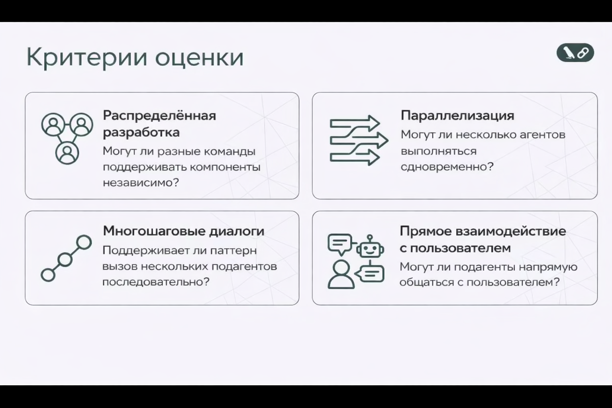
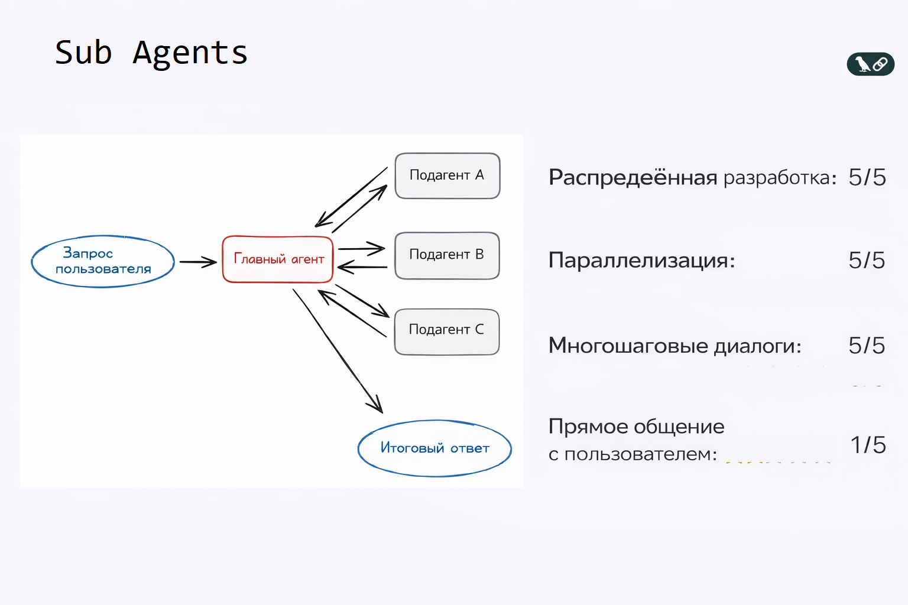
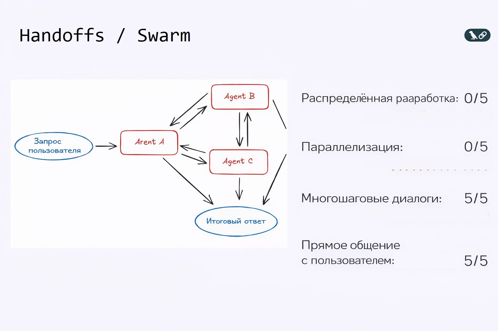
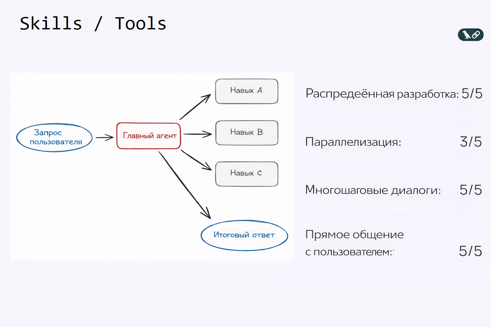

# 🧠 Выбор правильной Multi-Agent архитектуры

Multi-Agent системы сегодня — один из ключевых инструментов при создании сложных AI-продуктов.
Но **когда они действительно нужны**, и **какую архитектуру выбрать**?

В этом материале мы разберём **4 базовых архитектурных паттерна Multi-Agent систем**:

* Subagents (Субагенты)
* Handoffs/Swarm (Передача управления / Рой )
* Skills (Навыки)
* Router (Маршрутизатор)

И научимся выбирать правильный паттерн **под конкретную задачу**.

---

## ⚠️ Важное предупреждение: Multi-Agent нужны не всегда

Первое и самое важное:

> ❗ **Во многих случаях вам вообще не нужна Multi-Agent архитектура.**

Большинство агентных задач:

* отлично решаются **одним агентом**
* с **грамотно спроектированными инструментами**

Multi-Agent имеют смысл, когда:

* растёт сложность задач
* требуется масштабирование
* разные части системы развиваются независимо

См. пример простого агента [README.md](Agent_04_Drafter/README.md)
---

## 📏 Критерии выбора архитектуры

Перед тем как сравнивать паттерны, введём **4 ключевых критерия оценки**.



### 1. Распределённая разработка

Могут ли разные агенты **независимо поддерживать компоненты системы**?

### 2. Параллелизация

Могут ли **несколько агентов работать одновременно**?

### 3. Многошаговые диалоги (Multi-hop)

Поддерживает ли архитектура **последовательные вызовы агентов с сохранением контекста**?

### 4. Прямое взаимодействие с пользователем

Могут ли **Subagents напрямую общаться с пользователем**, а не только через центральный узел?

---

## 🧩 Паттерн 1: Subagents / Supervisor (Субагенты / Строгий контроль )



### Как работает

* Есть **главный агент (supervisor)**
* Он управляет **подагентами как инструментами**
* Вся маршрутизация проходит через него

**Поток:**

```
Запрос пользователя → Главный агент → Подагенты → Главный агент → Итоговый ответ
```

### Оценка

* ⭐⭐⭐⭐⭐ Распределённая разработка
* ⭐⭐⭐⭐⭐ Параллелизация
* ⭐⭐⭐⭐⭐ Многошаговые диалоги
* ⭐ Прямое взаимодействие с пользователем

### Когда использовать

* сложные системы
* чёткое централизованное управление
* разные команды отвечают за разных подагентов

см. пример подобного агента: [README.md](Supervisor/README.md)
---

## 🔁 Паттерн 2: Handoffs/Swarm (Передача управления / Рой )



### Как работает

* Агент может **передать управление другому агенту**
* Любой агент может:

  * продолжить диалог
  * завершить его
  * вернуть ответ пользователю

**Поток не централизован**, управление «переходит по цепочке».

### Оценка

* — Распределённая разработка
* — Параллелизация
* ⭐⭐⭐⭐⭐ Многошаговые диалоги
* ⭐⭐⭐⭐⭐ Прямое общение с пользователем

### Когда использовать

* сложные диалоговые сценарии
* reasoning-heavy задачи
* ассистенты с «живым» переключением ролей

---

## 🧠 Паттерн 3: Навыки / Инструменты (Skills / Tools)



### Как работает

* Есть **один главный агент**
* Он **динамически подключает навыки**:

  * специализированные промпты
  * знания
  * инструменты

Это называется **progressive disclosure** —
контекст загружается **только когда он нужен**.

### Оценка

* ⭐⭐⭐⭐⭐ Распределённая разработка
* ⭐⭐⭐ Параллелизация
* ⭐⭐⭐⭐⭐ Многошаговые диалоги
* ⭐⭐⭐⭐⭐ Прямое общение с пользователем

### Когда использовать

* масштабируемые агентные системы
* контроль контекста
* сложные продукты без полного мультиагентного оверхеда

---

## 🧭 Паттерн 4: Маршрутизатор (Router)


### Как работает

1. Router классифицирует входящий запрос
2. Направляет его одному или нескольким агентам
3. Synthesizer собирает финальный ответ

Router и Synthesizer могут быть:

* агентными
* или полностью детерминированными

### Оценка

* ⭐⭐⭐ Распределённая разработка
* ⭐⭐⭐⭐⭐ Параллелизация
* — Многошаговые диалоги
* ⭐⭐⭐ Прямое общение с пользователем

### Когда использовать

* fan-out задачи
* классификация + агрегация
* высокопараллельные системы

---

## 📊 Сводная таблица: собираем всё вместе


| Паттерн   | Распределённая разработка | Параллелизация | Multi-hop | Прямое общение |
| --------- | ------------------------- | -------------- | --------- | -------------- |
| Субагенты | ⭐⭐⭐⭐⭐                     | ⭐⭐⭐⭐⭐          | ⭐⭐⭐⭐⭐     | ⭐              |
| Эстафеты  | —                         | —              | ⭐⭐⭐⭐⭐     | ⭐⭐⭐⭐⭐          |
| Навыки    | ⭐⭐⭐⭐⭐                     | ⭐⭐⭐            | ⭐⭐⭐⭐⭐     | ⭐⭐⭐⭐⭐          |
| Роутер    | ⭐⭐⭐                       | ⭐⭐⭐⭐⭐          | —         | ⭐⭐⭐            |

---

## 🧩 Главный вывод

> ✅ **Начинайте с простого.**

1. Один агент
2. Потом — skills
3. И только затем:

   * subagents
   * handoffs
   * router

👉 **Архитектура должна расти вместе со сложностью задачи**, а не опережать её.

---


Использовано видео "Choosing the Right Multi-Agent Architecture" https://www.youtube.com/watch?v=fqvbxkgU6vE
 
Документация: https://docs.langchain.com/oss/python/langchain/multi-agent#choosing-a-pattern
