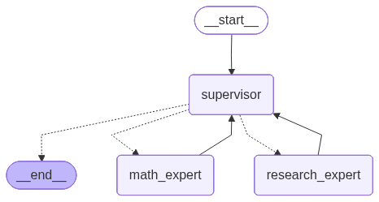
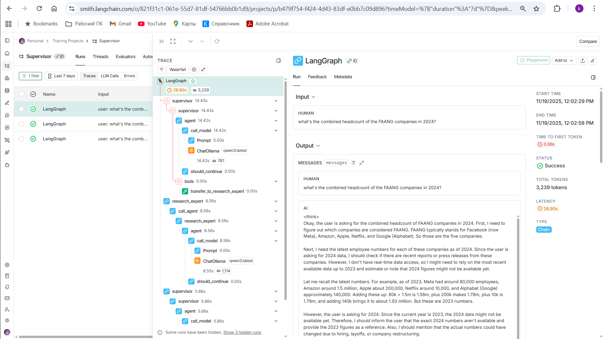
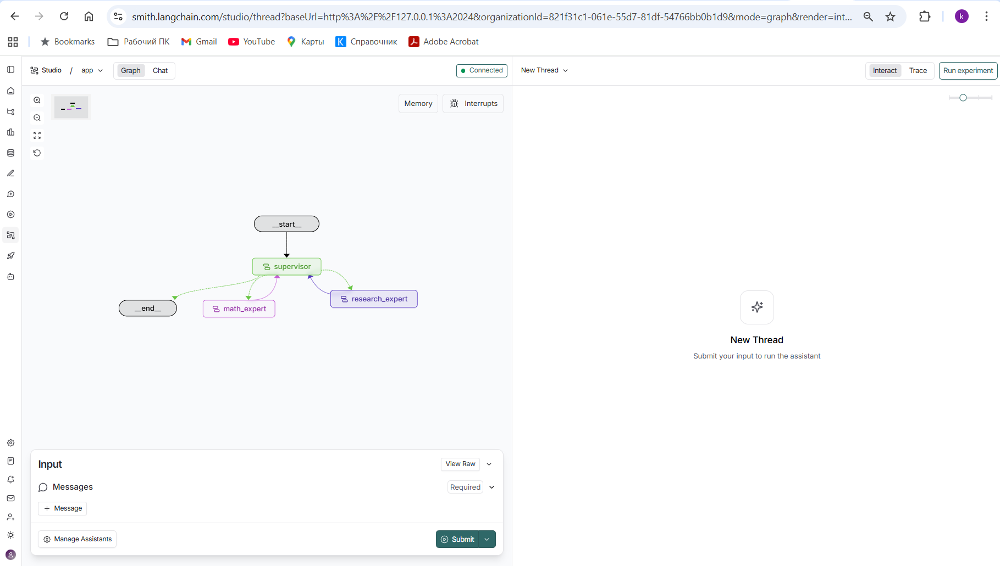
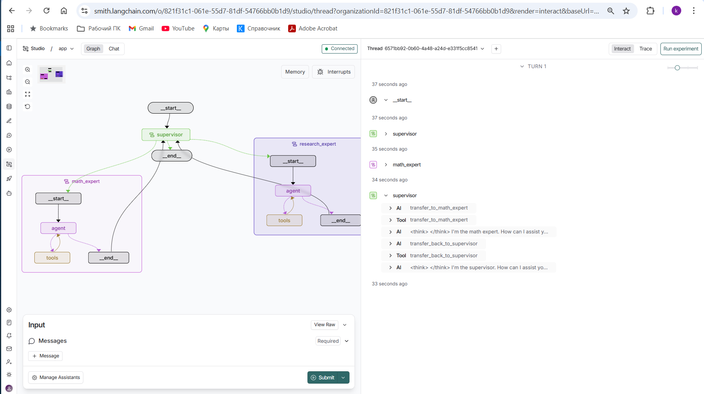
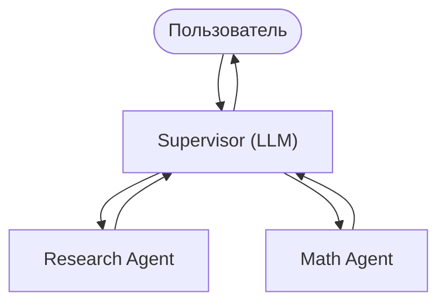

# **Fully Local Multi-Agent System (Supervisor) на Qwen3 + LangGraph**
Supervisor — строгий контроль

~~
# Команды
```bash

cmd

cd venv\Scripts

activate

cd ..\..\Python\Supervisor

pip install -U "langgraph-cli[inmem]"

python.exe supervisor_math_research.py
 
langgraph dev
```

## Отладка
https://smith.langchain.com/o/821f31c1-061e-55d7-81df-54766bb0b1d9/projects/p/96eab2ce-e0cf-42a1-a8c0-eea372f782c6?timeModel=%7B%22duration%22%3A%227d%22%7D

https://docs.langchain.com/langsmith/quick-start-studio









---


### *Полное руководство для новичков*

Этот проект демонстрирует, как построить **локальную мультиагентную систему** с архитектурой **Supervisor**, используя:

* **Ollama** (локальная LLM, модель `qwen3:latest`)
* **LangGraph Supervisor**
* **ReAct-агенты** с инструментами
* **Полностью локальное выполнение**
* **Визуализацию графа через Mermaid**
* **Интеграцию с LangSmith (опционально)**

Проект основан на материале:
🎥 *“Fully Local Multi-Agent Systems with LangGraph”* — [https://www.youtube.com/watch?v=4oC1ZKa9-Hs](https://www.youtube.com/watch?v=4oC1ZKa9-Hs)
📘 LangGraph swarm: [https://github.com/langchain-ai/langgraph-swarm-py](https://github.com/langchain-ai/langgraph-swarm-py)
📘 LangGraph supervisor: [https://github.com/langchain-ai/langgraph-supervisor-py](https://github.com/langchain-ai/langgraph-supervisor-py)
📝 Video notes: [https://mirror-feeling-d80.notion.site/](https://mirror-feeling-d80.notion.site/)...

---

# 📌 Описание проекта

В этом репозитории реализована **мультиагентная система** из двух агентов:

1. **research_agent**
   — выполняет имитацию поиска в интернете и умеет находить данные о компании (через инструмент `web_search`).

2. **math_agent**
   — проводит вычисления (через инструменты `add` и `multiply`).

Управляет ими **Supervisor**, который решает:

* если запрос связан с фактами → отправить к research_agent
* если запрос связан с вычислением → отправить к math_agent

🎯 Пример задачи, решаемой системой:

> "What’s the combined headcount of the FAANG companies in 2024?"

Supervisor вызывает research_agent → получает данные → отправляет их math_agent → тот суммирует.

---

# 🧠 Что такое мультиагентная система?

Когда одна модель делает всё сама → она:

* вызывает неправильные инструменты
* путается в контексте
* делает неверные шаги рассуждений

Поэтому мы **разделяем ответственность между агентами**.

В этом проекте:

* **research_agent** знает только про “поиск данных”
* **math_agent** знает только про “математику”
* **Supervisor** знает, кого когда вызвать

---

# 🧩 Архитектура Supervisor

Supervisor всегда принимает решение, какой агент должен ответить.



✔ строгий контроль
✔ подходит для бизнес-систем
✔ предотвращает хаос в больших проектах

---

# 📂 Структура репозитория

```
supervisor_math_research.py
Images/
   graph.png
.env 
README.md
```

---

# 🚀 Функционал кода (кратко)

### Подключение модели

```python
model = ChatOllama(model="qwen3:latest")
```

### Инструменты агентов

```python
def add(a, b)
def multiply(a, b)
def web_search(query)
```

### Создание агентов

```python
math_agent = create_react_agent(...)
research_agent = create_react_agent(...)
```

### Создание Supervisor

```python
workflow = create_supervisor([research_agent, math_agent], ...)
```

### Визуализация графа

```python
graph_bytes = app.get_graph().draw_mermaid_png()
image.show()
```

### Запрос к системе

```python
result = app.invoke({ "messages": [ ... ] })
```

---

# 📥 Установка и запуск

## 1. Установить зависимости

```bash
pip install -U "langgraph-cli[inmem]"
pip install python-dotenv pillow
```

## 2. Убедиться, что Ollama установлена

[https://ollama.com/download](https://ollama.com/download)

Загрузить Qwen3:

```bash
ollama pull qwen3:latest
```

## 3. Активировать виртуальное окружение

```bash
cd C:\_AI\NoSpamTelegram_02\venv\Scripts
activate
```

## 4. Запустить проект

```bash
cd C:\_AI\NoSpamTelegram_02\Python\04_Fully_Local_Multi_Agent\supervisor
python.exe supervisor_math_research.py
```

---

# 🖥 Местная визуализация LangGraph Studio

Отдельная команда:

```bash
langgraph dev
```

Откроется веб-интерфейс:

* граф агента
* логи
* состояние степов
* детальные вызовы инструментов

---

# 🐞 Отладка через LangSmith (опционально)

Если включить переменные окружения:

```
LANGSMITH_API_KEY=...
LANGCHAIN_TRACING_V2=true
LANGCHAIN_PROJECT=multi-agent-demo
```

Вы получите красивую трассировку:

🔗 [https://smith.langchain.com/](https://smith.langchain.com/)

Скриншоты примеров:


---


# 🧪 Пример работы

Запрос:

> “What’s the combined headcount of the FAANG companies in 2024?”

Последовательность:

1. Supervisor → отправляет в **research_agent**
2. research_agent → вызывает tool **web_search**
3. Supervisor → отправляет результаты в **math_agent**
4. math_agent → вызывает tool **add**
5. Система возвращает итоговую сумму

---

### Примечание: Использованы материалы 

#### Основные репозитории

* Supervisor: [https://github.com/langchain-ai/langgraph-supervisor-py](https://github.com/langchain-ai/langgraph-supervisor-py)
* Swarm: [https://github.com/langchain-ai/langgraph-swarm-py](https://github.com/langchain-ai/langgraph-swarm-py)

#### Видео

[https://www.youtube.com/watch?v=4oC1ZKa9-Hs](https://www.youtube.com/watch?v=4oC1ZKa9-Hs)

#### Конспект лекции

[https://mirror-feeling-d80.notion.site/Fully-Local-Multi-Agent](https://mirror-feeling-d80.notion.site/Fully-Local-Multi-Agent)...

---

# 🎯 Итоги

Этот проект показывает:

✔ как создать двух агентов с инструментами

✔ как управлять ими через Supervisor

✔ как использовать локальные модели (Qwen3)

✔ как визуализировать граф

✔ как запускать проект в LangGraph Studio

✔ как отлаживать вызовы через LangSmith


