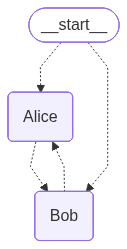
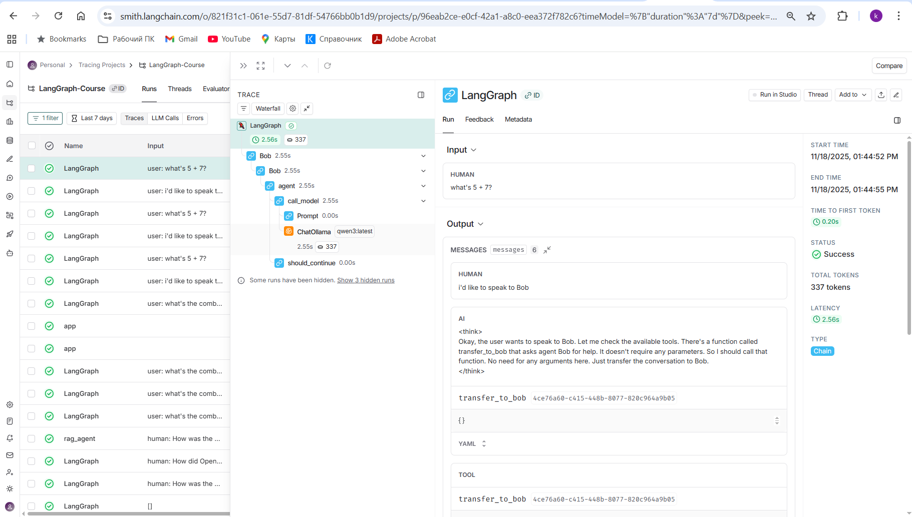
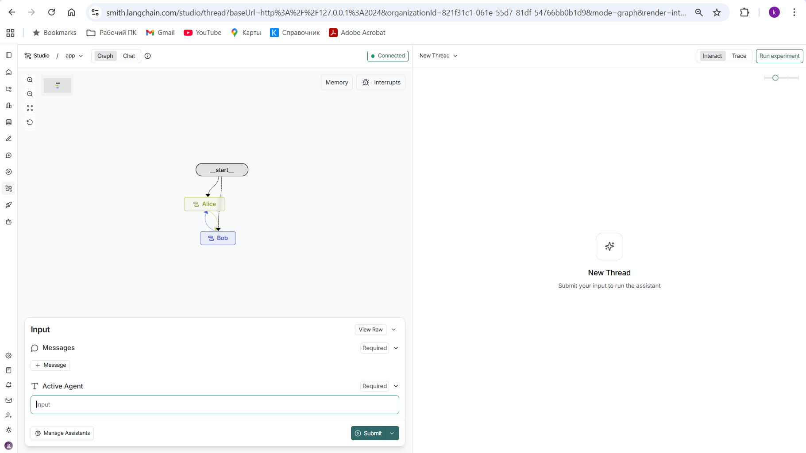
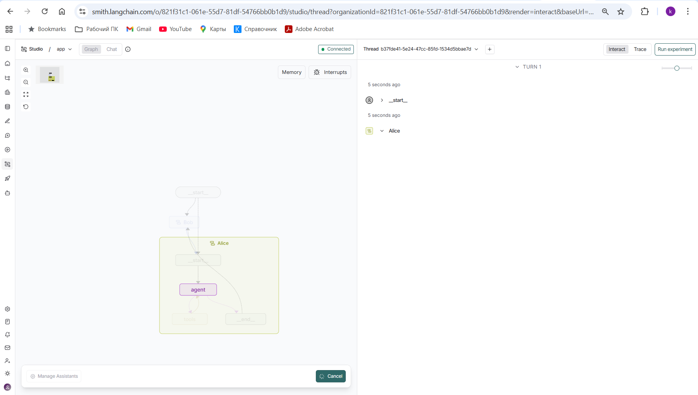
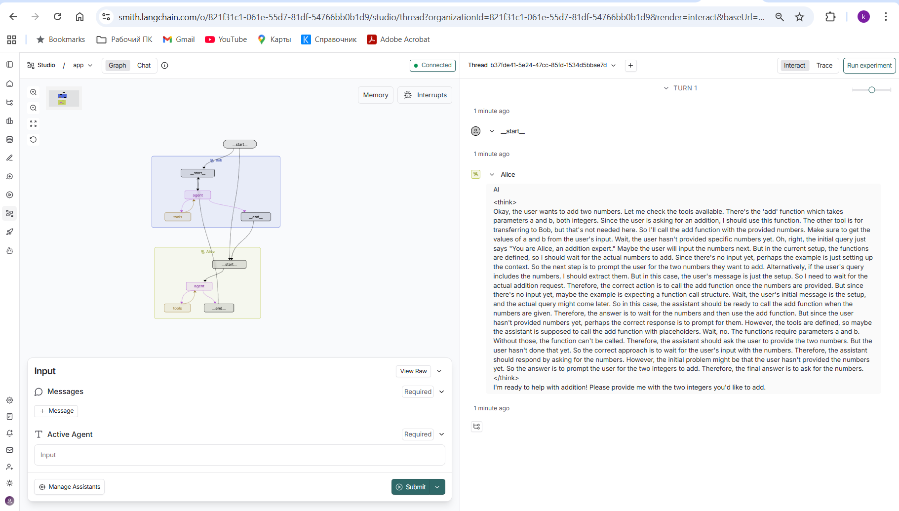
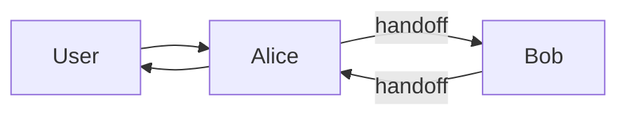
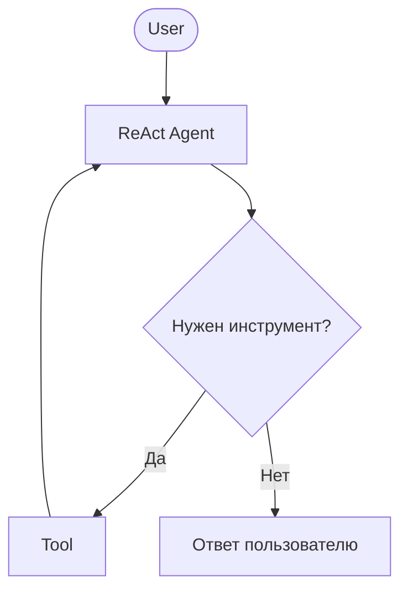

# 🤖 Fully Local Multi-Agent Swarm with LangGraph

### *Пример мультиагентной системы Alice ↔ Bob на локальной модели Qwen3 (Ollama)*

swarm


~~
# Команды
```bash


cmd

cd venv\Scripts

activate

cd ..\..\Python\Swarm

pip install -U "langgraph-cli[inmem]"

python.exe swarm_flight_hotel.py
 
langgraph dev
```

## Отладка
https://smith.langchain.com/o/821f31c1-061e-55d7-81df-54766bb0b1d9/projects/p/96eab2ce-e0cf-42a1-a8c0-eea372f782c6?timeModel=%7B%22duration%22%3A%227d%22%7D

https://docs.langchain.com/langsmith/quick-start-studio











## API Key
https://smith.langchain.com/o/821f31c1-061e-55d7-81df-54766bb0b1d9/settings/apikeys

---

# 🤖 Fully Local Multi-Agent Swarm with LangGraph

### *Мультиагентная система Alice ↔ Bob на локальной модели Qwen3 (Ollama)*

Этот репозиторий демонстрирует, как создать **полностью локальную мультиагентную систему** на основе:

* 🧠 **LangGraph Swarm**
* 🔄 **ReAct-агентов**
* 🛠 **инструментов и handoff между агентами**
* 🖥 **локальной LLM через Ollama (Qwen3 / Llama3)**
* 🎛 **визуализации графа агентов (Mermaid → PNG)**
* 🧩 **LangGraph Studio (langgraph dev)**
* 📌 **отладки через LangSmith (опционально)**

Основано на курсе:
📺 **Fully Local Multi-Agent Systems with LangGraph**
[https://www.youtube.com/watch?v=4oC1ZKa9-Hs](https://www.youtube.com/watch?v=4oC1ZKa9-Hs)

Конспект:
[https://mirror-feeling-d80.notion.site/Fully-Local-Multi-Agent-1b5808527b178066bde0ed981b27998c](https://mirror-feeling-d80.notion.site/Fully-Local-Multi-Agent-1b5808527b178066bde0ed981b27998c)

---

# 📘 Описание проекта

Этот пример реализует простую, но полностью рабочую мультиагентную систему:

* **Alice** — эксперт по математике, умеет складывать числа через инструмент `add(a, b)`
* **Bob** — «пират», который не умеет считать и передаёт математические задачи Alice

Swarm-архитектура позволяет агентам:

* ⚡ передавать друг другу управление (**handoff**)
* 💬 вести диалог в рамках одной ветки (`thread_id`)
* 🧠 сохранять состояние через **InMemorySaver**
* 🎛 визуализировать граф агентов

---

# 🧩 Что такое Swarm?

Swarm — это мультиагентная архитектура, где **каждый агент равноправен**, и любой может передать управление другому в зависимости от задачи.



В отличие от Supervisor, здесь **нет единого центра**, и диалог может "перекидываться" между агентами.

---

# 🚀 Возможности

* 🤖 **Multi-agent collaboration** — агенты работают вместе
* 🔄 **Automatic handoff** — передача контекста и управления
* 🛠 **Custom tools** — можно добавлять свои инструменты
* 🧠 **Memory support** — краткосрочная и долгосрочная память
* 🧩 **LangGraph Studio** — визуализация и отладка графов
* 🔍 **Human-in-the-loop** — возможность вмешиваться в процессе

Библиотека основана на:
📌 [https://github.com/langchain-ai/langgraph](https://github.com/langchain-ai/langgraph)
📌 [https://github.com/langchain-ai/langgraph-swarm-py](https://github.com/langchain-ai/langgraph-swarm-py)

---

# 📦 Установка

## 1. Требования

* Python **3.11**
* Установленный **Ollama**
* Локальная LLM (например Qwen3):

  ```
  ollama pull qwen3
  ```

---

## 2. Установка зависимостей

```bash
pip install -U "langgraph-cli[inmem]"
pip install langgraph-swarm langchain-ollama pillow python-dotenv
```

---

# 📂 Пример кода (Alice ↔ Bob)

```python
from io import BytesIO
from PIL import Image as PILImage
import os
from dotenv import load_dotenv

from langchain_ollama import ChatOllama
from langgraph.checkpoint.memory import InMemorySaver
from langgraph.prebuilt import create_react_agent
from langgraph_swarm import create_handoff_tool, create_swarm

load_dotenv()

model = ChatOllama(model="qwen3:latest")

def add(a: int, b: int) -> int:
    return a + b

alice = create_react_agent(
    model,
    [add, create_handoff_tool(agent_name="Bob")],
    prompt="You are Alice, an addition expert.",
    name="Alice",
)

bob = create_react_agent(
    model,
    [create_handoff_tool(agent_name="Alice", description="Transfer to Alice, she can help with math")],
    prompt="You are Bob, you speak like a pirate.",
    name="Bob",
)

checkpointer = InMemorySaver()

workflow = create_swarm(
    [alice, bob],
    default_active_agent="Alice",
)
app = workflow.compile(checkpointer=checkpointer)

# Visual graph
graph_bytes = app.get_graph().draw_mermaid_png()
image = PILImage.open(BytesIO(graph_bytes))
image.show()

# Interaction
config = {"configurable": {"thread_id": "1"}}

print(app.invoke({"messages": [{"role": "user", "content": "i'd like to speak to Bob"}]}, config))
print(app.invoke({"messages": [{"role": "user", "content": "what's 5 + 7?"}]}, config))
```

---

# 💬 Как работает диалог

### 1. Пользователь: «I'd like to speak to Bob»

* активный агент: Alice
* Alice вызывает handoff → управление переходит Bob

### 2. Пользователь: «What's 5 + 7?»

* активный агент: Bob
* Bob понимает, что не умеет считать
* handoff → Alice
* Alice вызывает инструмент `add(5, 7)`
* результат: **12**

---

# 🌐 Визуализация графа агентов

Код:

```python
graph_bytes = app.get_graph().draw_mermaid_png()
image = PILImage.open(BytesIO(graph_bytes))
image.show()
```

Результат — PNG со связями:

```
Alice → Bob  
Bob → Alice  
```

---

# 🎛 Запуск LangGraph Studio

Если хочешь визуально смотреть выполнение графа:

```bash
langgraph dev
```

Открывает локальный UI:
[http://localhost:8123](http://localhost:8123)

---

# 🧪 Отладка через LangSmith (опционально)

Добавь в `.env`:

```
LANGCHAIN_TRACING_V2=true
LANGSMITH_API_KEY=xxx
LANGCHAIN_PROJECT="AliceBobSwarm"
```

Отладка:
[https://smith.langchain.com/](https://smith.langchain.com/)

---

# 🧠 Memory: краткосрочная и долгосрочная память

Для multi-turn диалогов **обязательно** нужен `checkpointer`.

```python
checkpointer = InMemorySaver()
store = InMemoryStore()

app = workflow.compile(
    checkpointer=checkpointer,   # short-term memory
    store=store                  # long-term memory
)
```

Без этого Swarm забудет последнего активного агента.

---

# 🛠 Кастомизация

Swarm можно расширить:

### ✔ кастомные инструменты

### ✔ кастомные handoff-команды

### ✔ агенты с отдельными message-каналами

### ✔ собственные state-машины

Документация:
[https://langchain-ai.github.io/langgraph/concepts/multi_agent](https://langchain-ai.github.io/langgraph/concepts/multi_agent)
[https://github.com/langchain-ai/langgraph-swarm-py](https://github.com/langchain-ai/langgraph-swarm-py)

---

# 🔧 Кастомный handoff (пример)

```python
def create_custom_handoff_tool(agent_name):
    @tool
    def handoff(task_description: str, state: dict, tool_call_id: str):
        return Command(
            goto=agent_name,
            graph=Command.PARENT,
            update={
                "messages": state["messages"] + [ToolMessage(content="Handoff to " + agent_name)],
                "active_agent": agent_name,
                "task_description": task_description,
            },
        )
    return handoff
```

---

# 📌 Папка проекта: рекомендованная структура

```
/
│ swarm_alice_bob.py
│ README.md
│ .env
└── Images/
    ├─ graph.png
    ├─ DeBug_01.png
    ├─ DeBug_02.png
    ├─ DeBug_03.png
    └─ DeBug_04.png
```

---

# 🎯 Итоги

Этот репозиторий — отличная основа для изучения:

* мультиагентных систем
* LangGraph Swarm
* локальных моделей через Ollama
* визуализации и отладки агентов
* построения бизнес-процессов на основе AI

---

# 🚀 Fully Local Multi-Agent System (Swarm) on LangGraph

### *Пример мультиагентной системы Alice ↔ Bob на локальной модели Qwen3 (Ollama)*

Этот репозиторий демонстрирует, как построить **полностью локальную мультиагентную систему** на основе:

* 🧠 **LangGraph Swarm**
* 🔄 **ReAct-агентов**
* 🧰 **инструментов (tools) + handoff между агентами**
* 🖥 **локальной LLM через Ollama (Qwen3, Llama3 и др.)**
* 🧩 **визуализации графа агентов**
* 📌 **отладки через LangSmith (необязательно)**

Основано на курсе
**“Fully Local Multi-Agent Systems with LangGraph”**
Видео: [https://www.youtube.com/watch?v=4oC1ZKa9-Hs](https://www.youtube.com/watch?v=4oC1ZKa9-Hs)

---

# 📘 Описание проекта

Этот пример показывает:

* как создать **двух агентов (Alice и Bob)**
* как между ними работает **handoff** (переброс управления)
* как подключить **локальную модель Qwen3 через Ollama**
* как визуализировать граф агента через **Mermaid → PNG**
* как выполнять **многошаговый диалог с сохранением контекста**
* как использовать **инструменты** внутри агента (здесь — функция `add(a, b)`)

---

# 🧠 Структура агентов

## Агент Alice

* эксперт по математическому сложению
* имеет инструмент `add(a, b)`
* может передавать управление Bob через `create_handoff_tool("Bob")`

## Агент Bob

* “говорит как пират”
* не умеет считать
* при вопросах по математике передаёт управление Alice
  (`create_handoff_tool("Alice")`)

---

# 🧩 Архитектура Swarm

Этот проект использует **LangGraph Swarm**:

```
User → (Alice) → Bob → Alice → … → User
```

Любой агент может передать управление другому.
Нет единого центрального контроллера (как в Supervisor).

### 🔄 Пример handoff:

Пользователь → Bob: “What’s 5 + 7?”
Bob передаёт задачу Alice → Alice вызывает tool → ответ.

---

# 📂 Код проекта (коротко)

Файл делает:

1. Загружает `.env` (опционально — LangSmith)
2. Создаёт модель Ollama
3. Создаёт функцию `add(a, b)`
4. Создаёт агентов Alice и Bob
5. Объединяет их в **Swarm workflow**
6. Строит PNG-граф агентов
7. Выполняет два вызова `app.invoke`
8. Печатает результаты

---

# 📦 Установка и запуск

## 1. Требования

* Python **3.11**
* Установленный **Ollama**
* Локальная модель **Qwen3**

  ```
  ollama pull qwen3
  ```
* Опционально: LangSmith аккаунт

---

## 2. Установка зависимостей

```bash
pip install -U "langgraph-cli[inmem]"
pip install pillow python-dotenv langchain-ollama
```

---

## 3. Структура проекта

```
/
│ swarm_alice_bob.py
│ .env
│ README.md
└─ Images/
```

---

## 4. Запуск

```bash
python swarm_alice_bob.py
```

---

# 🍃 Визуализация: Mermaid → PNG

Граф агентов генерируется автоматически:

```python
graph_bytes = app.get_graph().draw_mermaid_png()
image = PILImage.open(BytesIO(graph_bytes))
image.show()
```

Пример (будет отображён в PNG):

```
Alice → Bob
Bob → Alice
```

---

# 💬 Диалог с агентами

```python
config = {"configurable": {"thread_id": "1"}}
```

`thread_id` позволяет сохранять контекст.

---

### Пример вызова 1

Пользователь хочет поговорить с Bob:

```python
turn_1 = app.invoke(
    {"messages": [{"role": "user", "content": "i'd like to speak to Bob"}]},
    config,
)
```

### Пример вызова 2

Пользователь спрашивает:

```
what's 5 + 7?
```

Bob передаёт Alice → Alice вызывает tool → возвращает **12**.

---

# 🧪 Отладка через LangSmith (опционально)

Если в `.env` указано:

```
LANGCHAIN_TRACING_V2=true
LANGSMITH_API_KEY=...
LANGCHAIN_PROJECT="AliceBobSwarm"
```

То можно видеть выполнение графа:

[https://smith.langchain.com/](https://smith.langchain.com/)

---

# 📚 Полезные ресурсы

### LangGraph Swarm

[https://github.com/langchain-ai/langgraph-swarm-py](https://github.com/langchain-ai/langgraph-swarm-py)

### LangGraph Supervisor

[https://github.com/langchain-ai/langgraph-supervisor-py](https://github.com/langchain-ai/langgraph-supervisor-py)

### Видео-курс

[https://www.youtube.com/watch?v=4oC1ZKa9-Hs](https://www.youtube.com/watch?v=4oC1ZKa9-Hs)

### Конспект

[https://mirror-feeling-d80.notion.site/Fully-Local-Multi-Agent-1b5808527b178066bde0ed981b27998c](https://mirror-feeling-d80.notion.site/Fully-Local-Multi-Agent-1b5808527b178066bde0ed981b27998c)

---

# 🧩 Принцип работы ReAct-агента

Схема:



---


